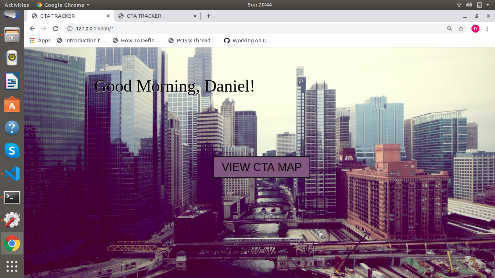
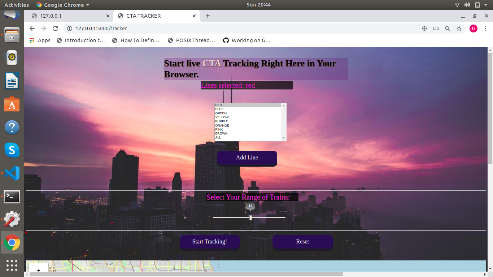

# Chicago-Tracker-Web
Allows to track every train of any line in Chicago

**Motivation**

When Chicago's public train system started to have live lighting trackings for navigation, I was a bit inspired to have a similar technology system in my own bedroom/apartment. This gave me the advantage to track the most nearst train in my location. Originally, in the train, we can only see our current train that and which stop it is at. I wanted to do this with all train lines and with a varity of them of my choosing. This application can be easiliy transferrable for physical LEDs that can pin point exactly the postion of a train. 

**To Run:**

excecute:

*export FLASK_APP=websock.py*

then, run:

*flask run*

This will take you to its main page as shown here:

To redirect our page to our tracker page, 

Head to: 

*http://127.0.0.1:5000/tracker*

It should redirct you to a page that looks like this:

**Description**

The way that is application works, we are able to use CTA's API key to continously make calls to their live dataset of our train system of our choice. This allowed me to obtain current data that is constantly changing which is then obtain using Python's flask library and emited our latitude and longitude coorinates to our frontend (HTML/CSS/JS) application. This is where we retrieve the emitted data and pin point these coordinates to our Chicago map and displayed.  Since our data is contantly changing, so is our frontend. Data is constantly being scrapped, emitted and and updated every 2 seconds, making a an optimal model for live tracking of your most convienent train line that we may typically use. 
